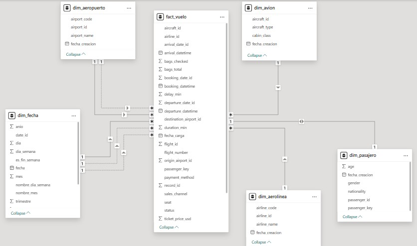

# Práctica 2 - Diseño de Dashboard y KPIs con Power BI

## 1. Descripción general

En esta práctica se conectó Power BI Desktop a la base de datos relacional creada en la Práctica 1 para construir un modelo tabular y un dashboard interactivo de vuelos.

El objetivo fue transformar datos operativos en indicadores clave (KPIs) para apoyar la toma de decisiones mediante visualizaciones claras.

## 2. Problema que se resolvió

Los datos transaccionales por sí solos no facilitan el análisis estratégico. Por eso se diseñó un modelo de análisis y un tablero que permite responder preguntas como:

- Cuántos vuelos se realizaron.
- Cuál fue el retraso acumulado.
- Qué aerolíneas y aeropuertos concentran mayor operación o mayor retraso.
- Cómo cambia el volumen de vuelos en el tiempo.

## 3. Alcance cumplido

Se completaron los siguientes puntos obligatorios:

- Conexión de Power BI a la base de datos de la práctica anterior.
- Diseño de un modelo tabular con relaciones entre tablas.
- Creación de medidas DAX para indicadores principales.
- Construcción de dashboard con varias visualizaciones interactivas.
- Uso de formato condicional en tarjetas KPI para reflejar desempeño.
- Documentación del diseño y la interpretación de resultados en este README.

## 4. Modelo de datos

Se implementó un esquema estrella:

- Tabla de hechos: fact_vuelo.
- Dimensiones: dim_fecha, dim_aerolinea, dim_pasajero, dim_avion, dim_aeropuerto.

La tabla fact_vuelo centraliza métricas operativas (duración, retraso, identificadores de vuelo) y se relaciona con dimensiones descriptivas para facilitar análisis por tiempo, aerolínea y aeropuerto.

## 5. Medidas DAX implementadas

Las medidas principales usadas en el dashboard fueron:

1. Total de vuelos

   Total Vuelos = COUNT(fact_vuelo[flight_id])

2. Promedio de duración

   Promedio Duración = AVERAGE(fact_vuelo[duration_min])

3. Total de retraso

   Total Delay = SUM(fact_vuelo[delay_min])

4. Total pasajeros

   Total Pasajeros = SUM(fact_vuelo[passenger_key])

5. KPI de vuelos por año

   Vuelos por Año =
   CALCULATE(
   [Total Vuelos],
   ALLEXCEPT(dim_fecha, dim_fecha[anio])
   )

## 6. Dashboard desarrollado

El dashboard incluye, como mínimo, las siguientes visualizaciones:

- Tarjeta KPI de Total de Vuelos.
- Tarjeta KPI de Promedio de Duración.
- Tarjeta KPI de Total de Retraso.

- Gráfico circular de total de vuelos por aerolínea.
- Gráfico de barras de retraso acumulado por aerolínea.
- Gráfico combinado (columnas y línea) de vuelos y retraso por aeropuerto.
- Serie temporal de vuelos por año, trimestre, mes y día.

Estas vistas permiten analizar tanto distribución (por aerolínea y aeropuerto) como comportamiento temporal.

## 7. Interpretación de resultados

Con este tablero se puede identificar:

- Qué aerolíneas tienen mayor volumen de vuelos.
- Qué aerolíneas acumulan más minutos de retraso.
- Qué aeropuertos presentan mejor o peor equilibrio entre operación y puntualidad.
- Variaciones de demanda y operación a lo largo del tiempo.

Esto facilita priorizar acciones de mejora operativa y monitorear desempeño con indicadores cuantificables.

## 8. Requerimientos técnicos utilizados

- Fuente de datos: base de datos relacional de la Práctica 1.
- Herramienta de análisis: Microsoft Power BI Desktop.
- Lenguaje de expresiones: DAX.
- Conocimientos aplicados: modelado tabular, relaciones, medidas, KPIs y visualización de datos.

## 9. Conclusión

El modelo estrella y las medidas DAX permiten análisis multidimensional, mientras que el dashboard resume el estado operativo en indicadores claros e interactivos.
