# Proyecto 2: Procesamiento y Analisis Exploratorio de Datos Masivos en BigQuery

## Descripcion General

Este proyecto realiza un analisis exploratorio de datos masivos sobre los viajes de taxi amarillo en Nueva York durante 2022. Se utilizaron herramientas de Google Cloud Platform, especificamente BigQuery, para procesar mas de 36 millones de registros filtrados y limpios. El objetivo fue identificar patrones de viaje, optimizar el costo de procesamiento con particiones y clustering, y construir modelos predictivos con BigQuery ML.

## Dataset Utilizado

| Propiedad                          | Detalle                                                        |
| ---------------------------------- | -------------------------------------------------------------- |
| Fuente                             | bigquery-public-data.new_york_taxi_trips.tlc_yellow_trips_2022 |
| Total de registros (datos limpios) | 36,256,539                                                     |
| Columnas originales                | 20                                                             |
| Periodo                            | Enero 2022 - Diciembre 2022                                    |
| Formato                            | Tabla particionada en BigQuery                                 |

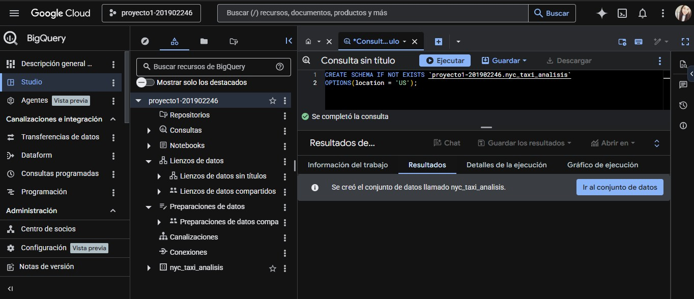

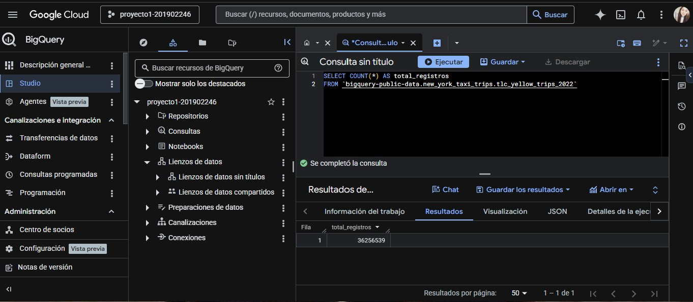

Columnas principales del dataset original:

| Columna             | Tipo      | Descripcion                          |
| ------------------- | --------- | ------------------------------------ |
| vendor_id           | STRING    | Identificador del proveedor de taxi  |
| pickup_datetime     | TIMESTAMP | Fecha y hora de recogida             |
| dropoff_datetime    | TIMESTAMP | Fecha y hora de llegada              |
| passenger_count     | INTEGER   | Numero de pasajeros                  |
| trip_distance       | NUMERIC   | Distancia del viaje en millas        |
| pickup_location_id  | STRING    | Zona de recogida                     |
| dropoff_location_id | STRING    | Zona de llegada                      |
| payment_type        | STRING    | Tipo de pago (1=tarjeta, 2=efectivo) |
| fare_amount         | NUMERIC   | Monto base de la tarifa              |
| tip_amount          | NUMERIC   | Monto de propina                     |
| total_amount        | NUMERIC   | Total cobrado                        |

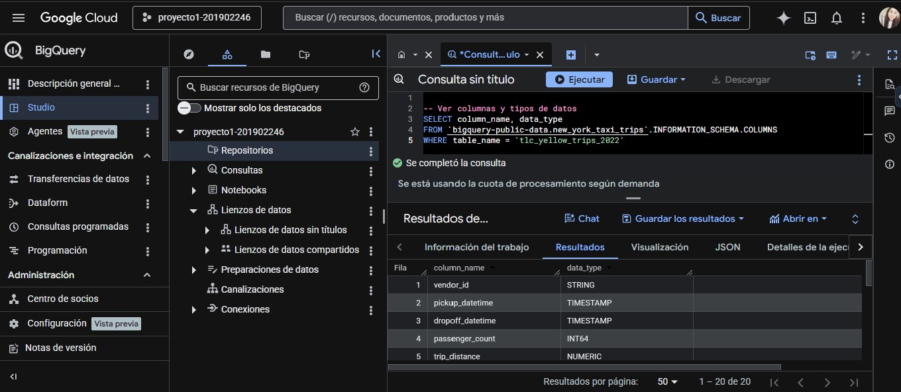

## Transformaciones Realizadas

Durante la preparacion de los datos se aplicaron los siguientes filtros y columnas derivadas:

Filtros de limpieza aplicados:

- pickup_datetime y dropoff_datetime no nulos
- fare_amount entre 1 y 500 (elimina valores negativos)
- trip_distance entre 0.1 y 100 millas
- passenger_count entre 1 y 6 pasajeros
- Solo registros del año 2022

Columnas derivadas creadas:

| Columna nueva    | Como se calcula                         | Para que sirve                                            |
| ---------------- | --------------------------------------- | --------------------------------------------------------- |
| fecha_viaje      | EXTRACT(DATE FROM pickup_datetime)      | Permite particionar la tabla por dia                      |
| hora_viaje       | EXTRACT(HOUR FROM pickup_datetime)      | Detectar patrones por hora                                |
| dia_semana       | EXTRACT(DAYOFWEEK FROM pickup_datetime) | Detectar diferencias entre dias laborales y fin de semana |
| mes_viaje        | EXTRACT(MONTH FROM pickup_datetime)     | Analizar tendencias mensuales                             |
| duracion_minutos | TIMESTAMP_DIFF(dropoff, pickup, MINUTE) | Medir la duracion real del viaje                          |
| dio_propina      | 1 si tip_amount > 0, 0 si no            | Variable objetivo para el modelo de clasificacion         |

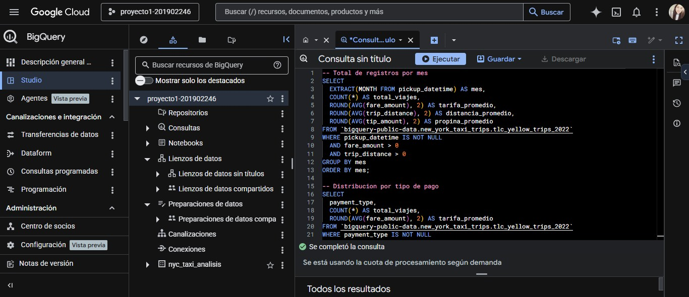

## Optimizacion con Particiones y Clustering

Se crearon dos versiones de la tabla de viajes para comparar el rendimiento:

### Tabla sin optimizacion: viajes_2022_base

- Sin particion ni clustering.
- Cada consulta escanea toda la tabla completa.

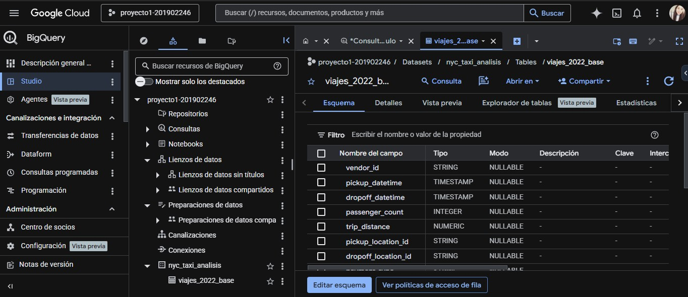

### Tabla optimizada: viajes_2022_optimizada

- Particion por: fecha_viaje (tipo DATE)
- Clustering por: pickup_location_id, dropoff_location_id, payment_type

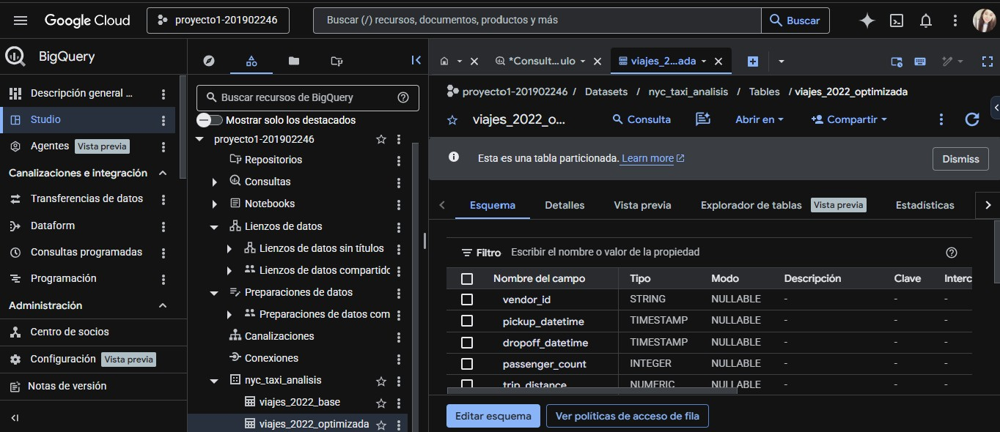

Por que se eligio esta configuración:

- La particion por fecha permite que BigQuery lea unicamente los dias consultados, en lugar de todo el año.
- El clustering por ubicacion y tipo de pago acelera consultas que filtran por zona o metodo de pago, que son los patrones mas comunes en este dataset.
- En BigQuery, la pantalla de "Detalles de la ejecucion" confirma que la tabla optimizada es reconocida como tabla particionada.

### Comparacion de rendimiento
#### Consulta con tabla sin optimizar
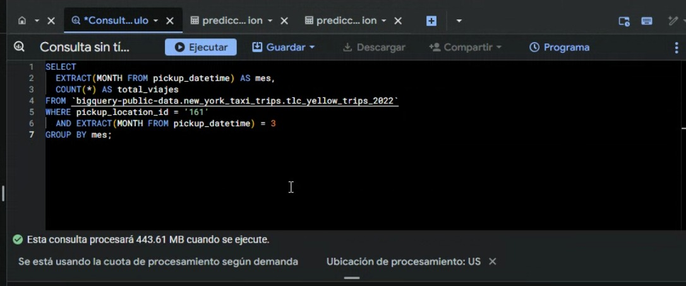
#### Consulta con tabla optimizada
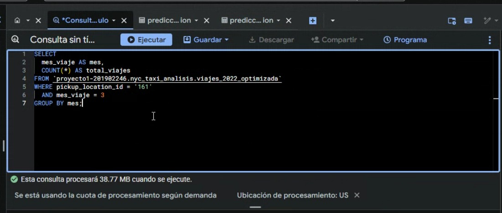
Para comparar el rendimiento se ejecuto la misma consulta filtrando por mes y zona sobre ambas tablas y se observo la diferencia en bytes procesados:

| Consulta              | Tabla usada            | Observacion                                          |
| --------------------- | ---------------------- | ---------------------------------------------------- |
| Filtro por mes y zona | viajes_2022_base       | Escanea toda la tabla                                |
| Mismo filtro          | viajes_2022_optimizada | Solo lee las particiones del rango de fecha indicado |

La tabla optimizada reduce significativamente los bytes leidos porque BigQuery puede descartar las particiones que no corresponden al filtro de fecha, sin necesidad de leer todos los registros.

## Modelos de BigQuery ML

Se entrenaron dos modelos predictivos sobre el dataset limpio dataset_entrenamiento.

### Prevencion de Data Leakage

Para evitar que el modelo aprenda de datos que no deberia ver durante el entrenamiento, se aplico:

- data_split_method = 'RANDOM': divide los datos de forma aleatoria.
- data_split_eval_fraction = 0.2: el 20% de los datos se reserva para evaluacion y el 80% se usa para entrenamiento.

Esto garantiza que el modelo no haya visto los datos de evaluacion al momento de aprender, lo cual da metricas de desempeño mas honestas.

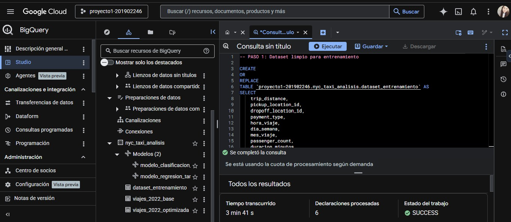

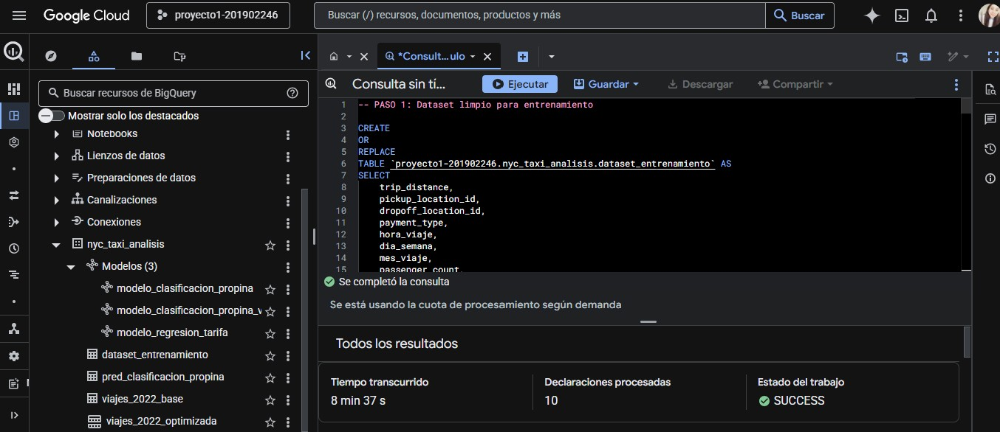

### Modelo 1: Regresion Lineal (modelo_regresion_tarifa)

**Objetivo:** Predecir el monto de la tarifa (fare_amount) de un viaje.

| Parametro           | Valor         |
| ------------------- | ------------- |
| Tipo de modelo      | LINEAR_REG    |
| Variable objetivo   | fare_amount   |
| max_iterations      | 20            |
| Split de evaluacion | 20% aleatorio |

Variables de entrada utilizadas:

| Variable            | Justificacion                                          |
| ------------------- | ------------------------------------------------------ |
| trip_distance       | La distancia es el principal determinante de la tarifa |
| pickup_location_id  | Las zonas tienen tarifas base diferentes               |
| dropoff_location_id | El destino influye en la distancia y peajes            |
| hora_viaje          | Las tarifas pueden variar segun la hora                |
| dia_semana          | Los fines de semana pueden tener diferente demanda     |
| mes_viaje           | La estacionalidad puede afectar los precios            |
| passenger_count     | Numero de pasajeros                                    |
| duracion_minutos    | Viajes mas largos generan tarifas mas altas            |

Resultados del modelo (ML.EVALUATE):

| Metrica               | Valor  |
| --------------------- | ------ |
| mean_absolute_error   | 0.9332 |
| mean_squared_error    | 7.8629 |
| median_absolute_error | 0.4733 |
| r2_score              | 0.9504 |
| explained_variance    | 0.9504 |

Interpretacion: El r2_score de 0.95 indica que el modelo explica el 95% de la variacion en las tarifas. El error absoluto medio de 0.93 significa que en promedio la prediccion se equivoca en menos de $1 dolar, lo cual es muy aceptable para este tipo de datos.

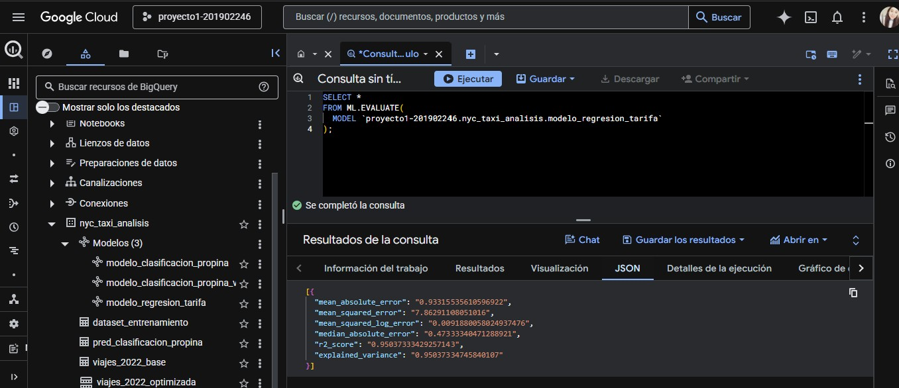

### Modelo 2: Regresion Logistica (modelo_clasificacion_propina)

**Objetivo:** Predecir si un pasajero dara propina (dio_propina = 1) o no (dio_propina = 0).

| Parametro           | Valor                                        |
| ------------------- | -------------------------------------------- |
| Tipo de modelo      | LOGISTIC_REG                                 |
| Variable objetivo   | dio_propina (binaria: '0' o '1')             |
| max_iterations      | 20                                           |
| l1_reg              | 0.1 (regularizacion para evitar sobreajuste) |
| Split de evaluacion | 20% aleatorio                                |

Variables de entrada utilizadas:

| Variable            | Justificacion                                     |
| ------------------- | ------------------------------------------------- |
| trip_distance       | Viajes largos tienden a recibir mas propina       |
| pickup_location_id  | Algunas zonas tienen cultura de propina diferente |
| dropoff_location_id | El destino puede influir en la propina            |
| hora_viaje          | Viajes nocturnos pueden recibir mas propina       |
| dia_semana          | Los fines de semana pueden tener mas propinas     |
| payment_type        | Los pagos con tarjeta facilitan dar propina       |
| passenger_count     | Grupos pueden dar mas propina                     |
| duracion_minutos    | Viajes largos pueden generar mas propina          |

Resultados del modelo (ML.EVALUATE):

| Metrica   | Valor  |
| --------- | ------ |
| precision | 0.9665 |
| recall    | 0.9996 |
| accuracy  | 0.9731 |
| f1_score  | 0.9827 |
| log_loss  | 0.1155 |
| roc_auc   | 0.9595 |

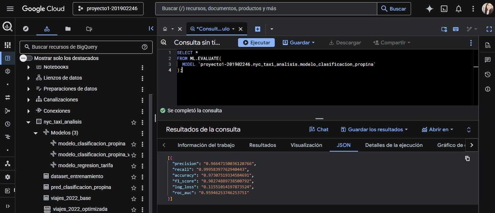

Matriz de confusion (ML.CONFUSION_MATRIX):

|              | Predijo: NO dio propina (0) | Predijo: SI dio propina (1) |
| ------------ | --------------------------- | --------------------------- |
| Real: NO (0) | 1,380,256 (verdaderos neg.) | 178,128 (falsos positivos)  |
| Real: SI (1) | 2,137 (falsos negativos)    | 5,134,606 (verdaderos pos.) |

El modelo identifica correctamente el 99.96% de los viajes con propina (recall muy alto). Solo clasifica mal 2,137 viajes que si dieron propina como si no la dieran.

### Modelo 3: Regresion Logistica v2 (modelo_clasificacion_propina_v2)

**Objetivo:** Misma tarea que Modelo 2, con hiperparametros distintos para comparar desempeño.

| Parametro           | Modelo 2 (v1) | Modelo 3 (v2) |
| ------------------- | ------------- | ------------- |
| Tipo de modelo      | LOGISTIC_REG  | LOGISTIC_REG  |
| max_iterations      | 20            | 50            |
| Regularizacion      | l1_reg = 0.1  | l2_reg = 0.1  |
| Split de evaluacion | 20% aleatorio | 30% aleatorio |

Resultados del modelo (ML.EVALUATE):

| Metrica   | Valor  |
| --------- | ------ |
| precision | 0.9664 |
| recall    | 0.9996 |
| accuracy  | 0.9730 |
| f1_score  | 0.9827 |
| log_loss  | 0.1156 |
| roc_auc   | 0.9594 |

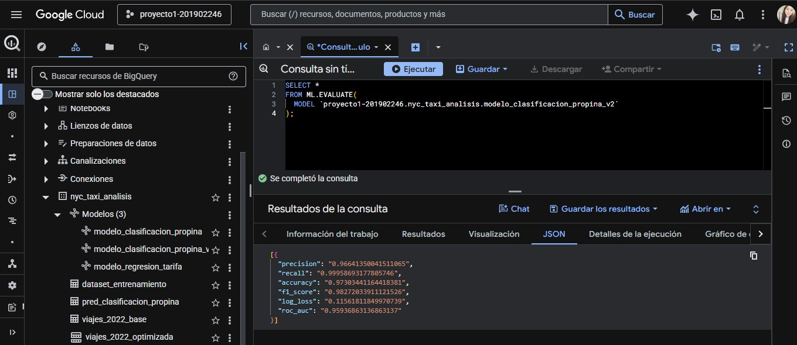

Matriz de confusion (ML.CONFUSION_MATRIX):

|              | Predijo: NO dio propina (0) | Predijo: SI dio propina (1) |
| ------------ | --------------------------- | --------------------------- |
| Real: NO (0) | 2,071,158 (verdaderos neg.) | 267,609 (falsos positivos)  |
| Real: SI (1) | 3,182 (falsos negativos)    | 7,700,146 (verdaderos pos.) |

---

### Comparacion entre Modelo 2 y Modelo 3

| Configuracion                       | precision | recall | accuracy | f1_score | roc_auc |
| ----------------------------------- | --------- | ------ | -------- | -------- | ------- |
| v1: l1_reg=0.1 / iter=20 / eval=20% | 0.9665    | 0.9996 | 0.9731   | 0.9827   | 0.9595  |
| v2: l2_reg=0.1 / iter=50 / eval=30% | 0.9664    | 0.9996 | 0.9730   | 0.9827   | 0.9594  |

Conclusiones de la comparacion:

- Ambos modelos obtienen metricas practicamente identicas, lo que indica que el modelo ya converge correctamente con solo 20 iteraciones.
- El recall de 0.9996 en ambas versiones confirma que el tipo de pago (payment_type) es una variable muy predictiva: los viajes pagados con tarjeta casi siempre registran propina.
- La regularizacion L1 (v1) y L2 (v2) producen resultados equivalentes en este dataset, por lo que se selecciona el Modelo 2 (v1) como modelo final por ser mas simple y usar menos datos de evaluacion.
- El roc_auc de 0.9595 en ambos modelos indica una excelente capacidad de separar viajes con y sin propina.

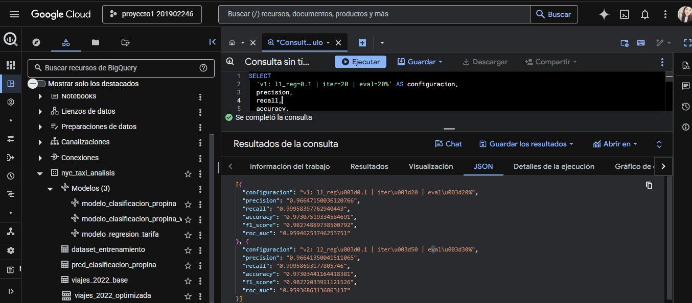

## Predicciones sobre Nuevos Registros

Se ejecutaron predicciones sobre la ultima fecha disponible en la tabla optimizada utilizando ambos modelos entrenados.

### Predicciones con Modelo 1 (Regresion Lineal)

Resultado: 57 registros con tarifa predicha comparada contra la tarifa real, incluyendo el error absoluto por registro.

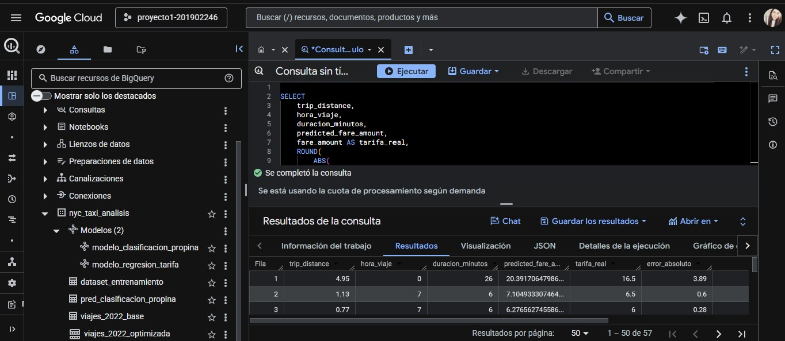

### Predicciones con Modelo 2 (Clasificacion Logistica)

Resultado: 57 registros con la prediccion de si el pasajero dara propina (0 o 1) comparada contra el valor real.

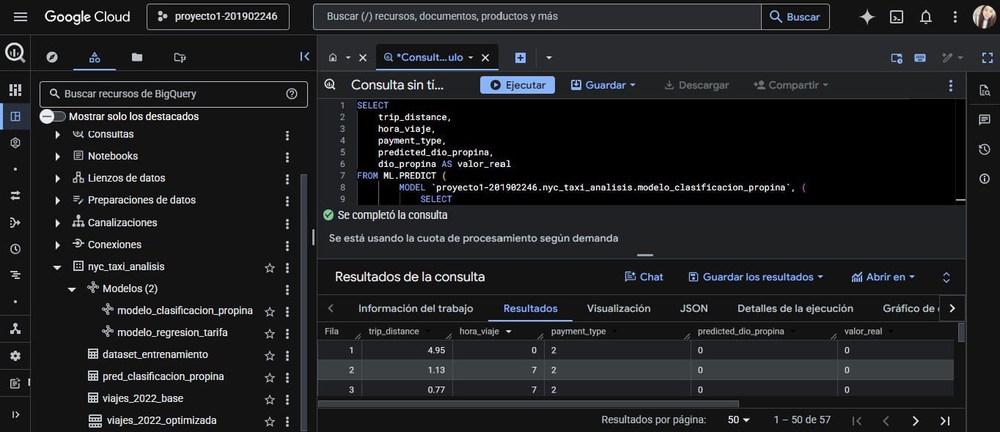

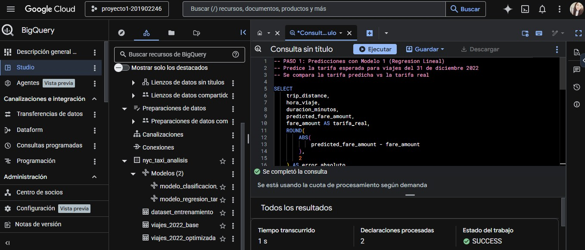

## Hallazgos Relevantes

A partir del analisis exploratorio se identificaron los siguientes patrones:

1. Volumen de viajes: El dataset limpio contiene 36,256,539 registros validos de viajes en 2022.

2. Patrones temporales: Las consultas de exploracion muestran variacion en el total de viajes y tarifa promedio por mes, con diferencias entre horas pico y horas de baja demanda.

3. Tipo de pago: La mayoria de los viajes se pagan con tarjeta de credito (tipo 2), lo cual facilita el registro de propinas en el sistema.

4. Zonas de recogida: Existen zonas con mucho mayor concentracion de viajes que otras, lo que indica puntos de alta demanda en la ciudad.

5. Propinas: La variable dio_propina muestra que una parte significativa de los viajes registra propina cuando el pago se realiza con tarjeta.

6. Prediccion de tarifa: El modelo de regresion obtiene un r2_score de 0.9504, lo que significa que explica el 95% de la variacion en las tarifas. El error absoluto promedio es de $0.93 dolares por viaje.

7. Clasificacion de propinas: Los modelos de clasificacion logran un recall de 0.9996 y roc_auc de 0.9595, lo que indica que el tipo de pago (tarjeta vs efectivo) es el predictor mas fuerte de si un pasajero dara propina o no.

8. Estabilidad de hiperparametros: La comparacion entre Modelo 2 y Modelo 3 muestra que aumentar las iteraciones de 20 a 50 y cambiar de regularizacion L1 a L2 no mejora significativamente las metricas, lo que indica que el modelo ya es estable con la configuracion base.

## Informe Visual

Tablero de Looker Studio con visualizaciones exploratorias y resultados de predicciones:

[> Enlace:https://datastudio.google.com/reporting/4a552641-7911-4a98-881e-dbadf39f4bab]

El tablero incluye:

- Viajes por mes (tendencia temporal)
- Tarifa promedio por hora del dia
- Distribucion por tipo de pago
- Comparacion de predicciones vs valores reales de los modelos

### 1. Viajes por Mes - NYC Taxi 2022

Esta gráfica de barras muestra la cantidad total de viajes realizados en cada mes del año 2022.

Se observa una tendencia creciente desde inicios de año, lo que sugiere una recuperación progresiva en la demanda del servicio de taxis. Los últimos meses presentan los valores más altos, lo cual puede estar relacionado con mayor actividad económica, turismo o estacionalidad (festividades y fin de año).

Este comportamiento permite identificar patrones de demanda a nivel macro y es útil para planificación operativa.
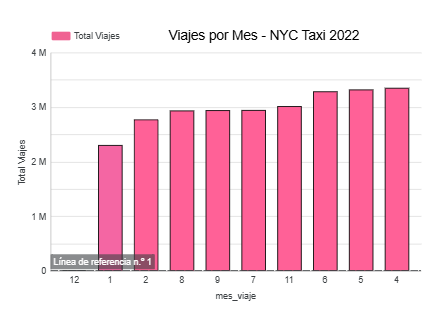

### 2. Total de Viajes a lo largo del tiempo

Esta gráfica de línea representa la evolución diaria del número de viajes durante todo el año.

Se identifican patrones cíclicos claros, donde hay variaciones frecuentes que corresponden a días de la semana (mayor demanda en días laborales o fines de semana). También se observan caídas abruptas en ciertos puntos, que pueden corresponder a eventos atípicos, problemas en el registro de datos o días con baja actividad.

Este tipo de visualización permite analizar tendencias temporales y detectar anomalías en los datos.
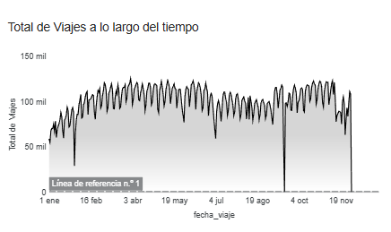

### 3. Tarifa Promedio por Hora del Día

Esta gráfica muestra cómo varía la tarifa promedio dependiendo de la hora del día.

Se observa que durante la madrugada y primeras horas del día las tarifas son más bajas, mientras que aumentan progresivamente hacia la noche, alcanzando su punto máximo en horas nocturnas. Esto puede explicarse por menor disponibilidad de taxis, mayor demanda o recargos nocturnos.

Este análisis permite entender el comportamiento dinámico de precios y cómo la hora influye directamente en el costo del servicio.
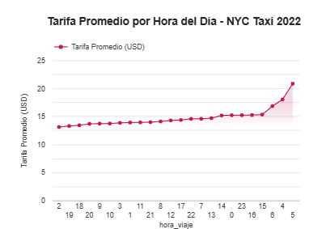

### 4. Distribución de Viajes por Tipo de Pago

Esta gráfica de pastel muestra la proporción de viajes según el método de pago.

Se observa que aproximadamente el 80% de los viajes se realizan con tarjeta, mientras que alrededor del 20% se pagan en efectivo. Esto indica una fuerte preferencia por pagos electrónicos, lo cual también influye en el registro de propinas (ya que es más fácil incluirlas con tarjeta).

Este hallazgo es clave para el modelo de clasificación de propinas, ya que el tipo de pago resulta ser una de las variables más predictivas.
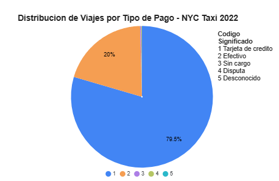

### 5. Tarifa Real vs Tarifa Predicha

Esta gráfica de dispersión compara los valores reales de la tarifa con los valores predichos por el modelo de regresión lineal.

Idealmente, los puntos deberían alinearse sobre una línea diagonal (predicción perfecta). En la gráfica se observa que, aunque existe cierta dispersión, la mayoría de los puntos siguen una tendencia lineal, lo que indica que el modelo tiene un buen ajuste.

Las desviaciones representan errores de predicción, pero en general el modelo logra aproximar correctamente las tarifas, lo cual coincide con el alto valor de R² ≈ 0.95 obtenido en la evaluación.

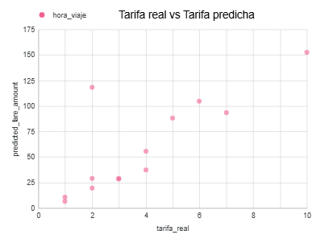

### 6. Predicciones de Propina - Modelo de Clasificación

Esta gráfica muestra la cantidad de registros clasificados como:

1 = sí dio propina
0 = no dio propina

Se observa una clara mayoría de casos donde sí se da propina, lo cual coincide con la distribución del dataset. El modelo logra identificar correctamente esta tendencia, mostrando un alto desempeño en métricas como recall y accuracy.

Este resultado confirma que el modelo es altamente efectivo para predecir el comportamiento de los usuarios respecto a las propinas.
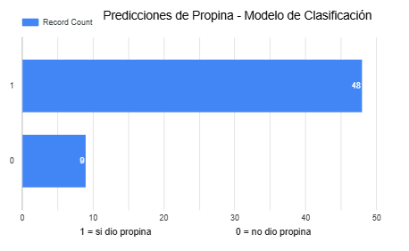