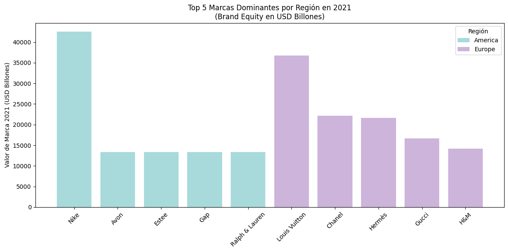

# Global Fashion Brands (2001–2021)

## Dataset Utilizado

**Nombre del dataset:** Global Fashion Brands  
**Fuente:** Kaggle  
**Enlace:** https://www.kaggle.com/datasets/jocelyndumlao/global-fashion-brands

El analisis de datos se enfoca en las marcas de moda que aparecieron en la lista de las 100 mejores marcas mundiales de Interbrand (es una de las consultoras de marca más grandes e importantes del mundo) entre 2001 y 2021.

#### Los datos que se analizarón incluyen:

- **Marca**: El nombre de la marca de moda.
- **País de origen** : El país donde se fundó la marca.
- **Región de origen (América, Europa)**: La región geográfica a la que pertenece la marca.
- **Sector industrial (moda)**: El sector industrial al que pertenece la marca, en este caso, moda.
- **Subsector industrial (confección, cosméticos, artículos de lujo y ropa deportiva)**: El subsector específico dentro de la industria de la moda al que pertenece la marca.

#### Los siguientes campos se extraen para cada año (2001-2021) con valores numéricos:

- **Clasificación de la marca**: La posición de la marca en la lista de las 100 mejores marcas mundiales de Interbrand.
- **Valor de marca (USD billion)**: El valor monetario de la marca en billones de dólares estadounidenses.
- **Crecimiento del valor de marca (%)**: El porcentaje de crecimiento del valor de la marca en comparación con el año anterior.

## Estado Inicial del Dataset

- Dimensiones originales: 30 filas × 68 columnas
- Duplicados encontrados: 0
- Presencia de valores faltantes en columnas históricas de Ranking, Equity y GrowthRate.

### Proceso de Limpieza de Datos

Se aplicaron las siguientes transformaciones:

### Eliminación de Duplicados

Se realizó una verificación de registros duplicados en el dataset utilizando el método:

```python
df.duplicated().sum()
```

El resultado indicó que no existen filas completamente duplicadas en el conjunto de datos.
Por lo tanto, no fue necesario eliminar registros.

Pero en caso de haberse identificado duplicados exactos, estos se habrían eliminado mediante:

```python
df.drop_duplicates(inplace=True)
```

Este método elimina filas que sean idénticas en todas sus columnas, garantizando que los datos sean unicos de los registros analizados.

### Estandarización de Valores y Formatos

- Se normalizaron las columnas de texto:
  - BrandName
  - BrandOriginCountry
  - BrandOriginRegion
  - BrandSector
  - BrandSubSector

Acciones realizadas:

- Eliminación de espacios innecesarios.
- Unificación de formato tipo _Title Case_.

---

### Conversión de Tipos de Datos

Las columnas anuales:

- Rank2001–Rank2021
- Equity2001–Equity2021
- GrowthRate2001–GrowthRate2021

Fueron convertidas a formato numérico utilizando:

```python
pd.to_numeric(errors="coerce")
```

Los valores no numéricos fueron convertidos a `NaN`.

NaN en las columnas numéricas se debe a que había valores no numéricos o vacíos que se convirtieron a NaN al usar pd.to_numeric con errors="coerce". Estos NaN indican que esos registros no tenían un valor numérico válido en esas columnas.

### Tratamiento de Valores Faltantes

- **GrowthRate:** Se reemplazaron valores faltantes con `0`, asumiendo ausencia de crecimiento reportado.
- **Equity:** Se reemplazaron valores faltantes con la mediana de cada columna anual.
- **Rank:** Se mantuvieron los valores `NaN`, ya que representan años en los que la marca no apareció en el ranking.

### Después del tratamiento:

- Todas las columnas **GrowthRate** quedaron sin valores faltantes.
- Las columnas **Equity** quedaron completas.
- Los valores faltantes restantes corresponden únicamente a **Ranking histórico**.

## Análisis Realizado

## Top 5 Marcas Dominantes por Región en 2021

Se identificaron las cinco marcas con mayor Brand Equity (USD Billones) en el año 2021 para cada región (América y Europa).

### Resultado:

| Región  | Marca          | Equity 2021 (USD Billones) |
| ------- | -------------- | -------------------------- |
| America | Nike           | $42,538                    |
| Europe  | Louis Vuitton  | $36,766                    |
| Europe  | Chanel         | $22,109                    |
| Europe  | Hermès         | $21,600                    |
| Europe  | Gucci          | $16,656                    |
| Europe  | H&M            | $14,133                    |
| America | Avon           | $13,381                    |
| America | Estee          | $13,381                    |
| America | Gap            | $13,381                    |
| America | Ralph & Lauren | $13,381                    |

---

## Visualización

La siguiente gráfica muestra las marcas dominantes por región en 2021 utilizando colores diferenciados por región.



## Interpretación de Resultados

- Nike lidera ampliamente la región América en 2021.
- Europa muestra mayor concentración de marcas de lujo con alto valor de marca como Louis Vuitton, Chanel y Hermès.
- Las marcas europeas dominan el segmento de lujo, mientras que América presenta liderazgo fuerte en marcas deportivas y comerciales.
- El análisis evidencia una diferencia estructural en el posicionamiento de mercado entre ambas regiones.

## Conclusión

El proceso de limpieza permitió estandarizar el dataset, tratar valores faltantes y preparar los datos para análisis comparativo regional.

El estudio confirma que en 2021:

- Europa domino el sector lujo.
- América lidero en marcas deportivas y comerciales.
- El valor de marca refleja posicionamiento estratégico y fortaleza global.
