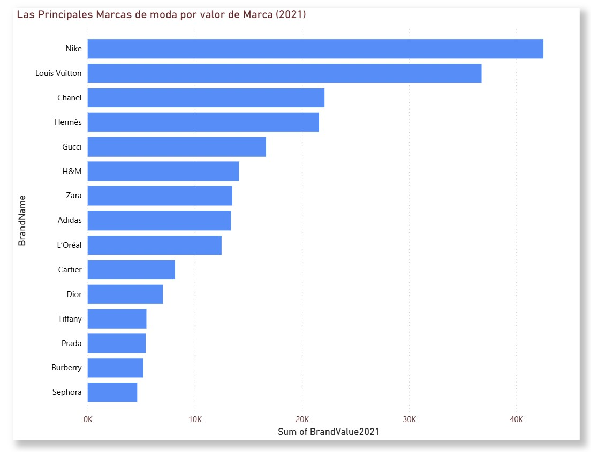

# Análisis de Marcas de Moda con Power BI

## Descripción del Dataset

El dataset **FashionBrands** contiene información sobre distintas marcas de moda reconocidas a nivel mundial. Este conjunto de datos incluye variables relacionadas con el valor de marca (Brand Value), ranking de las marcas y su crecimiento en diferentes años.

Entre las variables principales utilizadas para el análisis se encuentran:

- **BrandName:** nombre de la marca.
- **BrandOriginCountry:** país de origen de la marca.
- **BrandOriginRegion:** región de origen.
- **BrandValue2021:** valor estimado de la marca en el año 2021.
- **GrowthRate:** tasa de crecimiento de la marca.

Este dataset permite analizar qué marcas dominan el mercado de la moda y comparar el valor de marca entre diferentes empresas del sector.

## Transformaciones Realizadas

Antes de realizar las visualizaciones en Power BI, se llevaron a cabo algunas transformaciones en el conjunto de datos para mejorar el análisis:

- Verificación y corrección de los **tipos de datos** de cada columna.
- Selección de las **columnas más relevantes** para el análisis.
- Organización de los datos para facilitar su uso en las visualizaciones.
- Creación de relaciones y medidas necesarias para mostrar correctamente el valor de marca.

Estas transformaciones permitieron limpiar el dataset y preparar los datos para generar visualizaciones claras y comprensibles.

## Dashboard

A continuación se presentan algunas de las visualizaciones creadas en Power BI para analizar el valor de marca de las principales empresas de moda.

### Principales marcas de moda por valor de marca (2021)

Este gráfico de barras muestra las marcas con mayor valor de marca en el año 2021. Cada barra representa una empresa y el tamaño de la barra indica el valor estimado de la marca en el mercado.

## Interpretación de KPIs

A partir del análisis visual realizado en el dashboard se pueden identificar algunos puntos importantes:

- **Nike** se posiciona como la marca con mayor valor en 2021, destacándose claramente sobre las demás.
- **Louis Vuitton** ocupa el segundo lugar, lo que demuestra la fuerte presencia de las marcas de lujo en el mercado global.
- Otras marcas importantes como **Chanel, Hermès y Gucci** también presentan valores de marca elevados, consolidándose como líderes en la industria de la moda.
- Se observa que las marcas deportivas y las marcas de lujo dominan el ranking de valor de marca.
- Existe una diferencia significativa entre las primeras marcas del ranking y las que se encuentran en las últimas posiciones.

En general, el análisis permite identificar cuáles son las empresas más influyentes dentro de la industria de la moda y cómo se distribuye el valor de marca entre ellas.

## Conclusión

El uso de Power BI permitió transformar los datos del dataset en visualizaciones claras que facilitan el análisis del valor de marca de las principales empresas de moda. A través del dashboard es posible identificar las marcas líderes del mercado y comprender mejor la distribución del valor dentro de la industria.

Este tipo de análisis es útil para entender tendencias del mercado, posicionamiento de marcas y el impacto que tienen dentro de la industria global de la moda.
