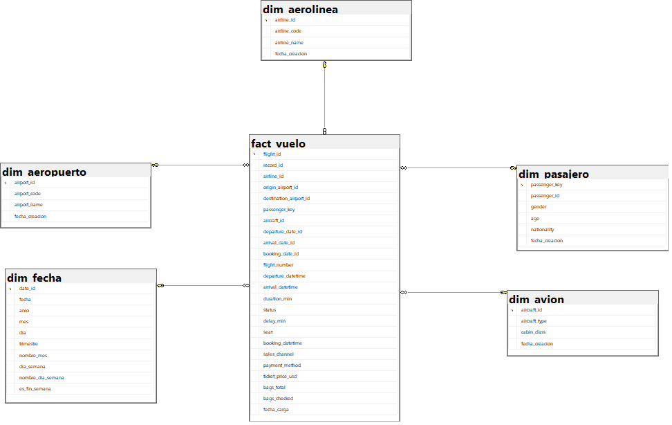

# ETL con Python  Análisis de Vuelos

**Nombre:** Claudia Paola Alonzo Hernández

## Descripción

Implementación de un proceso ETL (Extracción, Transformación y Carga) completo utilizando Python y SQL Server para analizar datos de vuelos. El proyecto incluye:

- Extracción de datos desde CSV
- Transformación y limpieza de datos
- Modelo multidimensional de inteligencia de negocios
- Carga de datos en SQL Server
- Consultas analíticas

## Objetivos

- Desarrollar un proceso ETL funcional en Python
- Implementar un modelo multidimensional para análisis de vuelos
- Generar indicadores de negocio mediante consultas SQL
- Aplicar buenas prácticas de ingeniería de datos

## Estructura del Proyecto

```
flight-data-etl/
├── imagenes/
│   └── modelo.png                 # Diagrama del modelo de datos
├── dataset_vuelos_crudo.csv      # Dataset original
├── create_database.sql            # Script de creación de BD
├── etl-vuelos.py                  # Script ETL principal
├── consultas.sql                  # Consultas SQL
├── config.py                      # Configuración de conexión
├── requirements.txt               # Dependencias Python
├── resultados_consultas.txt       # Resultados de consultas SQL
├── etl_vuelos.log                 # Log de ejecución del ETL
├── validaciones.md                # Resumen de validación de consultas
└── README.md                      # Este archivo
```

## Modelo de Datos

### Diagrama del Modelo Multidimensional

El modelo implementado sigue el patrón Esquema Estrella, donde la tabla de hechos se encuentra en el centro rodeada por las tablas dimensionales.



### Descripción del Modelo

El diseño utiliza un modelo dimensional tipo estrella que facilita las consultas analíticas y el análisis de negocio. Este patrón es ampliamente utilizado en data warehouses por su simplicidad y rendimiento.

#### Componentes del Modelo:

**Tabla de Hechos Central:**

- **fact_vuelo**: Contiene los registros transaccionales de cada vuelo con métricas cuantitativas (precio, duración, demora, equipaje) y claves foráneas hacia las dimensiones.

**Tablas Dimensionales (Alrededor de la tabla de hechos):**

1. **dim_aerolinea**: Información de las aerolíneas
   - airline_id (PK)
   - airline_code
   - airline_name

2. **dim_aeropuerto**: Catálogo de aeropuertos de origen y destino
   - airport_id (PK)
   - airport_code
   - airport_name

3. **dim_pasajero**: Datos demográficos de los pasajeros
   - passenger_key (PK)
   - passenger_id
   - gender
   - age
   - nationality

4. **dim_fecha**: Dimensión temporal para análisis por tiempo
   - date_id (PK)
   - fecha, año, mes, día
   - trimestre
   - día de la semana
   - es_fin_semana

5. **dim_avion**: Tipos de aeronave y clase de cabina
   - aircraft_id (PK)
   - aircraft_type
   - cabin_class

### Relaciones del Modelo

La tabla **fact_vuelo** mantiene relaciones de muchos a uno (N:1) con cada dimensión:

- Un vuelo pertenece a una aerolínea
- Un vuelo tiene un aeropuerto de origen y uno de destino
- Un vuelo tiene un pasajero asignado
- Un vuelo tiene una fecha de salida, llegada y reserva
- Un vuelo utiliza un tipo de avión y clase de cabina

Este diseño permite responder preguntas analíticas como:

- ¿Cuáles son las aerolíneas con más vuelos?
- ¿Qué rutas son más frecuentes?
- ¿Cuál es el perfil demográfico de los pasajeros?
- ¿Cómo varía la demanda por temporada?
- ¿Qué clase de cabina genera más ingresos?

## Instalación y Configuración

### 1. Requisitos Previos

- Python 3.10 o superior
- Microsoft SQL Server
- Driver ODBC para SQL Server

### 2. Configurar Entorno Virtual

```powershell
# Navegar a la carpeta del proyecto
cd Practica1

# Crear entorno virtual
python -m venv .venv

# Activar entorno virtual
.\.venv\Scripts\Activate.ps1

# Instalar dependencias
pip install -r requirements.txt
```

### 3. Configurar Base de Datos

```powershell
# Ejecutar el script SQL en SQL Server Management Studio
sqlcmd -S localhost -i create_database.sql
```

## Problemas Identificados en el Dataset

### 1. **Formatos de Fecha Inconsistentes**

- Formato 1: `DD/MM/YYYY HH:MM`
- Formato 2: `MM-DD-YYYY HH:MM AM/PM`

### 2. **Códigos de Aeropuerto**

- Algunos en minúsculas: `jfk`, `sjo`, `hav`
- Deben estandarizarse a mayúsculas

### 3. **Género Inconsistente**

- Valores encontrados: `M`, `F`, `X`, `Masculino`, `Femenino`, `m`, `masculino`
- Se normalizarán a: `M`, `F`, `X`

### 4. **Valores Nulos**

- Edad de pasajeros
- Nacionalidad
- Información de vuelos cancelados

### 5. **Nombres de Aerolíneas**

- Formato inconsistente (mayúsculas/minúsculas)

## Proceso ETL

### Extracción

- Lectura del archivo CSV `dataset_vuelos_crudo.csv`
- Validación de estructura y columnas

### Transformación

1. Limpieza de datos nulos y duplicados
2. Estandarización de formatos de fecha
3. Normalización de códigos de aeropuerto (UPPER)
4. Homologación de valores de género
5. Conversión de monedas a USD
6. Creación de dimensiones y tabla de hechos

### Carga

1. Inserción de dimensiones (sin duplicados)
2. Obtención de claves foráneas
3. Carga de tabla de hechos con relaciones

El archivo `consultas.sql` incluye 9 secciones completas de análisis:

### Sección 1: Validación de Datos

- Conteo de registros por tabla
- Verificación de integridad referencial

### Sección 2: Análisis de Vuelos

- Total de vuelos registrados
- Top 10 aerolíneas con más vuelos
- Top 10 rutas más frecuentes
- Top 10 destinos más populares
- Top 10 orígenes más frecuentes

### Sección 3: Análisis de Estado de Vuelos

- Distribución por estado (ON_TIME, DELAYED, CANCELLED, DIVERTED)
- Análisis de demoras (promedio, mínimo, máximo)
- Aerolíneas con más demoras
- Vuelos cancelados por aerolínea

### Sección 4: Análisis de Pasajeros

- Distribución por género
- Distribución por rango de edad
- Top 10 nacionaliProyecto

### Paso 1: Configurar Base de Datos

```powershell
# Ejecutar en SQL Server Management Studio (SSMS)
# Abrir y ejecutar: create_database.sql
```

### Paso 2: Verificar Configuración (Opcional)

```powershell
# Características del ETL Implementado

### Extracción
- Lectura robusta del CSV con manejo de encoding UTF-8
- Validación de estructura y registros

### Transformación
- Parseo flexible de fechas (múltiples formatos soportados)
- Normalización de códigos de aeropuerto (a mayúsculas)
- Normalización de género (M, F, X)
- Limpieza de precios (eliminación de comas, conversión a float)
- Estandarización de códigos de aerolínea y nombres
- Normalización de status, cabin_class, payment_method
- Eliminación de duplicados por record_id
- Manejo de valores nulos

### Carga
- Carga incremental de dimensiones (evita duplicados)
- Validación de claves foráneas antes de insertar en fact_vuelo
- Inserción por lotes para optimizar rendimiento
- Logging detallado del proceso
- Manejo de excepciones y errores
- Resumen de estadísticas al finalizar

### Características Adicionales
- Sistema de logging completo (archivo + consola)
- Contador de progreso durante la carga
- Reporte de tiempo de ejecución
- Limpieza automática de fact_vuelo
```

### Paso 3: Ejecutar ETL

```powershell
# Activar entorno virtual (si no está activo)
.\.venv\Scripts\Activate.ps1

# Ejecutar el script ETL
python etl-vuelos.py

# Se generará un archivo etl_vuelos.log con el detalle del proceso
```

### Paso 4: Ejecutar Consultas Analíticas

```powershell
 desde PowerShell:
sqlcmd -S localhost\SQLEXPRESS -d DW_Vuelos -C -i consultas.sql -o resultados_consultas.txt
```

### Documentación Detallada

### Sección 7: Análisis Temporal

- Vuelos por año
- Vuelos por mes
- Vuelos por día de la semana

### Sección 8: Análisis de Equipaje

- Distribución de equipaje total
- Promedio de equipaje por clase de cabina

### Sección 9: Consultas Complejas

- Perfil del viajero frecuente (Top 10)
- Top 10 rutas más rentables
- Comparación de puntualidad por aerolíneaELAYED, CANCELLED)
- Análisis de demoras promedio
- Distribución por género de pasajeros
- Ventas por canal (APP, WEB, AEROPUERTO, etc.)

## Tecnologías Utilizadas

- **Python 3.10+**
- **Pandas**: Manipulación de datos
- **PyODBC**: Conexión con SQL Server
- **SQLAlchemy**: ORM y gestión de conexiones
- **SQL Server**: Base de datos relacional

## Ejecución del ETL

```powershell
# Activar entorno virtual
.\.venv\Scripts\Activate.ps1

# Ejecutar el script ETL
python etl_vuelos.py
```
## Resultados Esperados

Al finalizar la ejecución del proceso ETL se espera obtener un conjunto de datos limpio, estandarizado y estructurado en un modelo dimensional para facilitar el análisis de vuelos.

### 1. Resultado del proceso ETL

El proceso debe completar exitosamente las tres etapas del pipeline:

- **Extracción:** lectura y validación del dataset original en formato CSV.
- **Transformación:** limpieza, normalización y estandarización de los datos.
- **Carga:** inserción de los datos procesados en SQL Server, respetando las relaciones entre dimensiones y tabla de hechos.

El proceso genera un archivo de log (`etl_vuelos.log`) que permite verificar el estado de la ejecución, errores encontrados, registros procesados y tiempo de ejecución.

### 2. Dataset transformado

Se espera que los datos presenten las siguientes características después de la transformación:

- Fechas convertidas a un formato estándar.
- Códigos de aeropuertos normalizados a mayúsculas.
- Géneros homologados a los valores `M`, `F` y `X`.
- Nombres y códigos de aerolíneas estandarizados.
- Precios convertidos a valores numéricos y expresados en USD.
- Registros duplicados eliminados utilizando `record_id`.
- Valores nulos tratados según las reglas definidas para cada atributo.
- Estados de vuelo y clases de cabina normalizados.

### 3. Modelo dimensional cargado

Se espera obtener un esquema estrella compuesto por:

- `fact_vuelo`
- `dim_aerolinea`
- `dim_aeropuerto`
- `dim_pasajero`
- `dim_fecha`
- `dim_avion`

La tabla `fact_vuelo` debe mantener correctamente las relaciones con las dimensiones mediante claves foráneas.

### 4. Validación de integridad

Las consultas de validación deben permitir comprobar:

- Cantidad de registros cargados en cada tabla.
- Ausencia de registros duplicados.
- Integridad referencial entre la tabla de hechos y las dimensiones.
- Existencia de claves foráneas válidas.
- Consistencia de los datos transformados.
- Correcta carga de los registros desde el proceso ETL.

### 5. Resultados del análisis de vuelos

Las consultas analíticas deben permitir identificar:

- Total de vuelos registrados.
- Aerolíneas con mayor cantidad de vuelos.
- Rutas de vuelo más frecuentes.
- Principales aeropuertos de origen y destino.
- Distribución de vuelos según su estado.
- Aerolíneas con mayor cantidad de vuelos retrasados.
- Cantidad de vuelos cancelados y desviados.

### 6. Resultados del análisis de pasajeros

El modelo permitirá analizar:

- Distribución de pasajeros por género.
- Distribución por rangos de edad.
- Principales nacionalidades.
- Identificación de pasajeros con mayor frecuencia de viaje.
- Perfil demográfico de los viajeros.

### 7. Resultados del análisis temporal

La dimensión `dim_fecha` permitirá analizar:

- Cantidad de vuelos por año.
- Cantidad de vuelos por mes.
- Cantidad de vuelos por día de la semana.
- Comportamiento de la demanda según períodos de tiempo.
- Diferencias entre días laborales y fines de semana.

### 8. Resultados del análisis de equipaje y cabina

Se espera obtener información sobre:

- Cantidad total de equipaje transportado.
- Promedio de equipaje por vuelo.
- Promedio de equipaje según clase de cabina.
- Distribución de pasajeros entre las diferentes clases de cabina.

### 9. Indicadores de negocio

Las consultas analíticas permitirán obtener indicadores como:

| Indicador | Descripción |
|---|---|
| Total de vuelos | Cantidad total de vuelos registrados |
| Aerolíneas líderes | Aerolíneas con mayor cantidad de vuelos |
| Rutas más frecuentes | Principales combinaciones origen-destino |
| Puntualidad | Distribución de vuelos según estado |
| Demora promedio | Tiempo promedio de retraso |
| Cancelaciones | Cantidad de vuelos cancelados por aerolínea |
| Rutas rentables | Rutas con mayores ingresos |
| Viajero frecuente | Pasajeros con mayor cantidad de vuelos |
| Ingresos por cabina | Comparación de ingresos según clase |
| Demanda temporal | Evolución de vuelos según período |


## Referencias

- [Documentación de Pandas](https://pandas.pydata.org/docs/)
- [PyODBC Documentation](https://github.com/mkleehammer/pyodbc/wiki)
- [SQLAlchemy Documentation](https://docs.sqlalchemy.org/)
- [Kimball Group - Dimensional Modeling](https://www.kimballgroup.com/)
